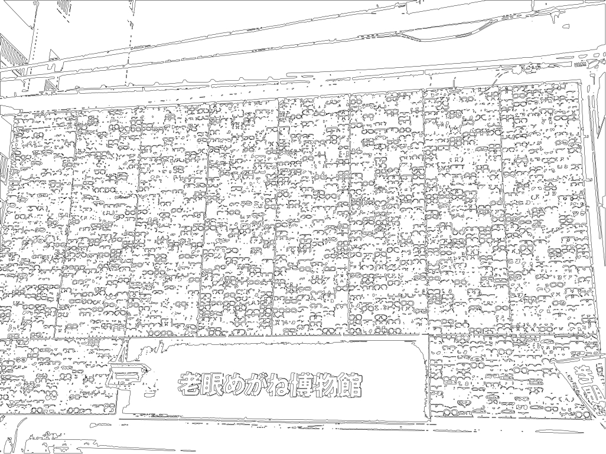
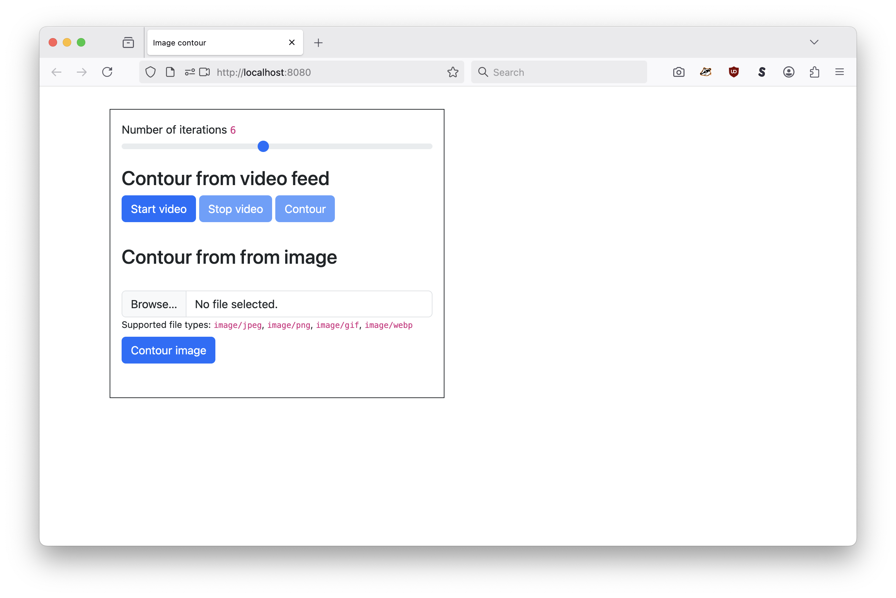
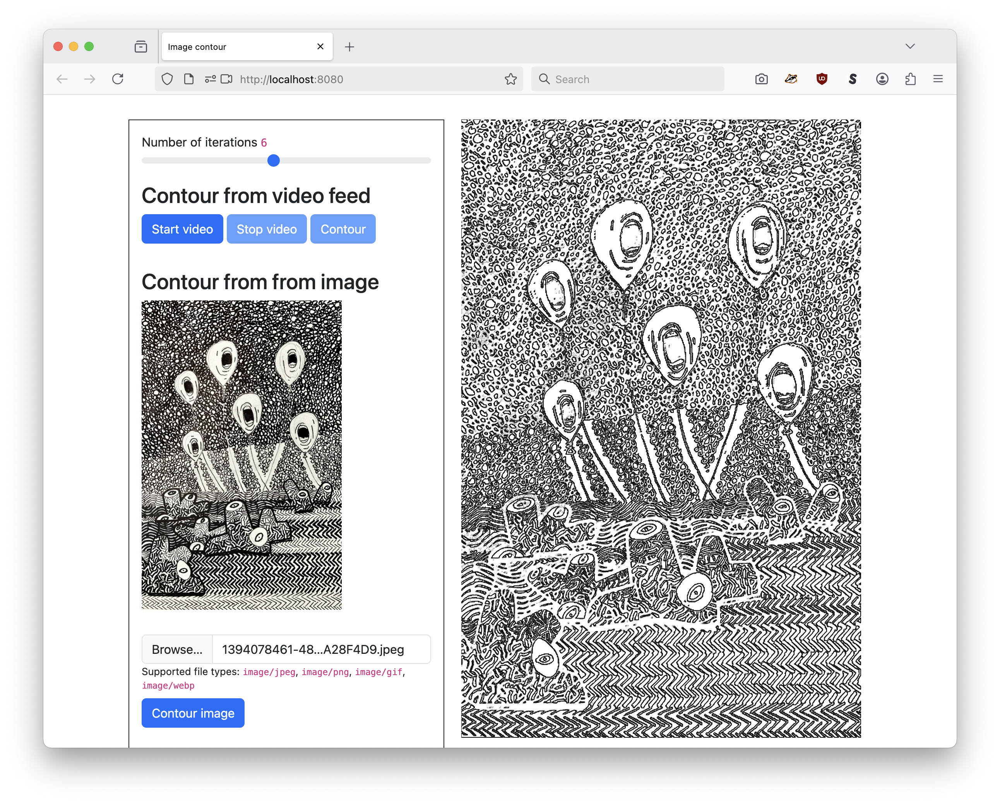
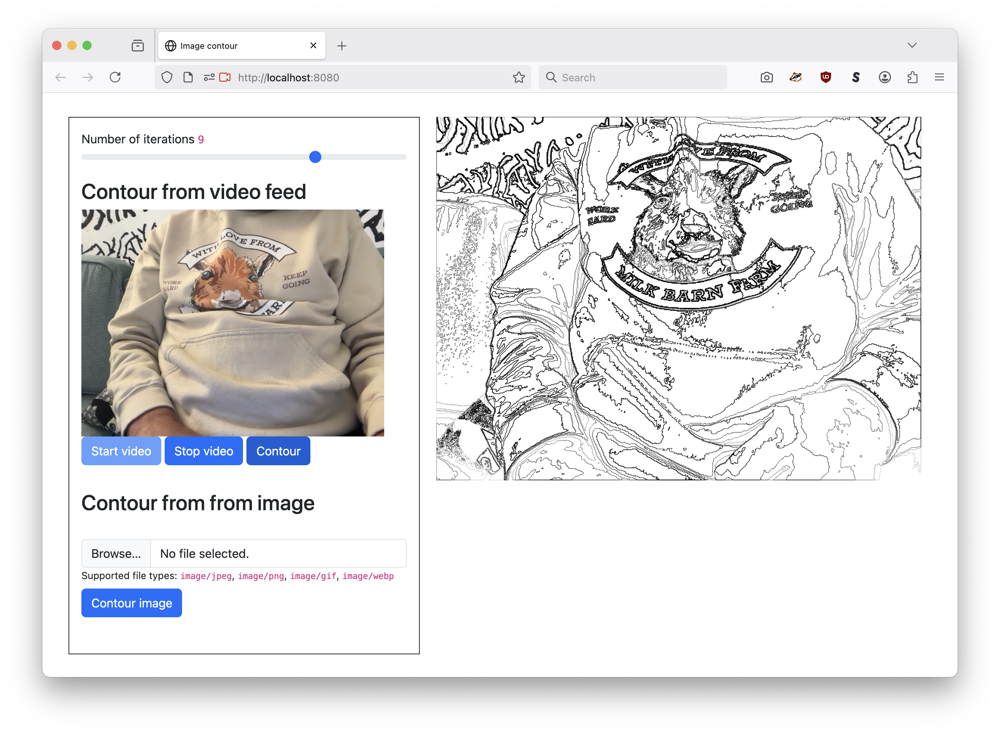

# go-image

There are many "wrapper" packages for working with images in Go. This one is mine.

## Important

These are image tools that I wrote by and for myself tailored to the needs of personal projects. It's possible they are not the image tools you need or want.

## Documentation

[](https://pkg.go.dev/github.com/aaronland/go-image/v2)

## Example

```
package main

import (
	"context"
	"flag"
	"os"

	"github.com/aaronland/go-image/v2/decode"
	"github.com/aaronland/go-image/v2/encode"
	"github.com/aaronland/go-image/v2/exif"
)

func main() {

	flag.Parse()

	ctx := context.Background()

	decode_opts := &decode.DecodeImageOptions{
		Rotate: true,
	}		  
		    
	for _, path := range flag.Args() {

		r, _ := os.Open(path)
		defer r.Close()

		im, _, ifd, _ := decode.DecodeImageWithOptions(ctx, r, decode_opts)
		ib, _ := exif.NewIfdBuilderWithOrientation(ifd, "1")

		new_path := fmt.Sprintf("%s.jpg", path)
		wr, _ := os.OpenFile(new_path, os.O_RDWR|os.O_CREATE, 0644)

		encode.EncodeJPEG(ctx, wr, im, ib, nil)
		wr.Close()
	}
}
```

_Error handling removed for the sake of brevity._

## Tools

``
$> make cli  TAGS=libheif
go build -mod vendor -ldflags="-s -w" -tags 'libheif' -o bin/transform cmd/transform/main.go
go build -mod vendor -ldflags="-s -w" -tags 'libheif' -o bin/resize cmd/resize/main.go
go build -mod vendor -ldflags="-s -w" -tags 'libheif' -o bin/halftone cmd/halftone/main.g
go build -mod vendor -ldflags="-s -w" -tags 'libheif' -o bin/contour cmd/contour/main.go
go build -mod vendor -ldflags="-s -w" -tags 'libheif' -o bin/contour-svg cmd/contour-svg/main.go
```

### transform

Transform one or more images applying one or more transform:// transformation URIs.

```
$> ./bin/transform -h
Transform one or more images applying one or more transform:// transformation URIs.
Usage:
	./bin/transform uri(N) uri(N)
  -apply-suffix string
    	An optional suffix to apply to the final image filename.
  -format string
    	An optional image format used to encode the final image.
  -preserve-exif
    	Copy EXIF data from source image final target image.
  -rotate
    	Automatically rotate based on EXIF orientation. This does NOT update any of the original EXIF data with one exception: If the -rotate flag is true OR the original image of type HEIC then the EXIF "Orientation" tag is re-written to be "1". (default true)
  -source-uri string
    	A valid gocloud.dev/blob.Bucket URI where images are read from. (default "file:///")
  -target-uri string
    	A valid gocloud.dev/blob.Bucket URI where images are written to. (default "file:///")
  -transformation-uri transform.Transformation
    	One or more additional transform.Transformation URIs used to further modify an image after resizing (and before any additional colour profile transformations are performed).
```

#### Example

Create a new PNG image with the Apple DisplayP3 colour profile and a maximum dimension of 1280 pixels at `./fixtures/tokyo-1280.png`

```
$> go run cmd/transform/main.go \
	-transformation-uri 'resize://?max=1280' \
	-transformation-uri displayp3:// \
	-apply-suffix -1280 \
	-preserve-exif \
	-format png \
	./fixtures/tokyo.jpg
```

### resize

Resize one or more images.

```
$> ./bin/resize -h
Resize one or more images.
Usage:
	./bin/resize uri(N) uri(N)
  -image-format string
    	Save files using this image format (just the extension not the mime-type).	
  -max int
    	The maximum dimension of the resized image
  -preserve-exif
    	Copy EXIF data from source image final target image.
  -profile string
    	An optional colour profile to apply to the resized image. Valid options are: adobergb, displayp3.
  -rotate
    	Automatically rotate based on EXIF orientation. This does NOT update any of the original EXIF data with one exception: If the -rotate flag is true OR the original image of type HEIC then the EXIF "Orientation" tag is re-written to be "1". (default true)
  -source-uri string
    	A valid gocloud.dev/blob.Bucket URI where images are read from. (default "file:///")
  -target-uri string
    	A valid gocloud.dev/blob.Bucket URI where images are written to. (default "file:///")
  -transformation-uri transform.Transformation
    	Zero or more additional transform.Transformation URIs used to further modify an image after resizing (and before any additional colour profile transformations are performed).
```

#### Example

Create a new JPEG image with a maximum dimension of 640 pixels and no EXIF data at `./fixtures/tokyo-1280.jpg`.

```
$> ./bin/resize -max 640 ./fixtures/tokyo.jpg
```

### halftone

Apply a halftone (dithering) process to one or more images.

```
$> ./bin/halftone -h
Apply a halftone (dithering) process to one or more images.
Usage:
	./bin/halftone uri(N) uri(N)
  -preserve-exif
    	Copy EXIF data from source image final target image.
  -process string
    	The halftone process to use. (default "atkinson")
  -rotate
    	Automatically rotate based on EXIF orientation. This does NOT update any of the original EXIF data with one exception: If the -rotate flag is true OR the original image of type HEIC then the EXIF "Orientation" tag is re-written to be "1". (default true)
  -scale-factor int
    	The scale factor to use for the halftone process. (default 2)
  -source-uri string
    	A valid gocloud.dev/blob.Bucket URI where images are read from. (default "file:///")
  -target-uri string
    	A valid gocloud.dev/blob.Bucket URI where images are written to. (default "file:///")
  -transformation-uri transform.Transformation
    	Zero or more additional transform.Transformation URIs used to further modify an image after resizing (and before any additional colour profile transformations are performed).
```

#### Example

```
$> ./bin/halftone -scale-factor 2 -process atkinson ./big-fish-001.jpg
```

### contour

Generate contour data derived from an image and draws the results to a new image.

```
$> ./bin/contour -h
  -n int
    	The number of iterations used to generate contours. (default 12)
  -scale float
    	The scale of the final output relative to the input image. (default 1)
  -source-uri string
    	A valid gocloud.dev/blob.Bucket URI where images are read from. (default "file:///")
  -target-uri string
    	A valid gocloud.dev/blob.Bucket URI where images are written to. (default "file:///")
  -transformation-uri transform.Transformation
    	Zero or more additional transform.Transformation URIs used to further modify an image after resizing (and before any additional colour profile transformations are performed).
```

For example:

```
$> ./bin/contour -n 3 fixtures/tokyo.jpg
```

Will transform this:


In to this:



### contour-svg

Generate contour data derived from an image and write the results as SVG path elements to a new file.

```
$> ./bin/contour-svg  -h
  -n int
    	The number of iterations used to generate contours. (default 12)
  -scale float
    	The scale of the final output relative to the input image. (default 1)
  -source-uri string
    	A valid gocloud.dev/blob.Bucket URI where images are read from. (default "file:///")
  -target-uri string
    	A valid gocloud.dev/blob.Bucket URI where images are written to. (default "file:///")
  -transformation-uri transform.Transformation
    	Zero or more additional transform.Transformation URIs used to further modify an image after resizing (and before any additional colour profile transformations are performed).
```

## WASM (WebAssembly)

### Building

This package comes with a pre-compile WASM binary which is stored in [www/wasm/contour.wasm](www/wasm). If you need or want to rebuild the binary the easiest way is to use the handy `wasmjs` Makefile target. For example:

```
$> make wasmjs
GOOS=js GOARCH=wasm \
		go build -mod vendor -ldflags="-s -w" -tags wasmjs \
		-o www/wasm/contour.wasm \
		cmd/contour-wasm-js/main.go
```

### Usage

The `contour.wasm` binary exposes two functions: `contour_image` and `contour_svg`. Each take the same arguments: A base64-encoded image to contour and the number of iterations used to generate that contour. Both functions return a JavaScript `Promise`. The `contour_image` function returns a base64-encoded image and the `contour_svg` returns a string containing an SVG document. For example:

```
const im_b64 = "base64-encoded image here...";
const iterations = 6;

contour_svg(im_b64, iterations).then((rsp) => {
	// Display SVG here
}).catch((err) => {
	console.error("Failed to contour image", err);
});	
```

Loading the `contour.wasm` binary in a JavaScript application is expected to be handled by the application itself. I like to use the [sfomuseum/js-sfomuseum-golang-wasm](https://github.com/sfomuseum/js-sfomuseum-golang-wasm) but there is no requirement to do so.

### Example

There is an example web application demonstrating the use of the `contour.wasm` binary in the [www](www) directory. To run the example you'll see to serve the application from a web browser. I like to the use the [aaronland/go-http-fileserver](https://github.com/aaronland/go-http-fileserver?tab=readme-ov-file#fileserver) tool, mostly because I wrote it, but any old web server will do. For example:

```
$> fileserver -root www/
2025/07/13 09:25:25 Serving www/ and listening for requests on http://localhost:8080
```

And then when you open your web browser to `http://localhost:8080` you'll see this:



You can upload individual images and have them converted in to SVG contours. For example:



You can also start a live video feed and generate SVG contours from individual video stills. For example:



That's really all the example application does. Saving or otherwise working with contour-ed images is left as an exercise to the reader (or a pull request).


## Decoders

The following image decoders are supported by default:

* `image/bmp`
* `image/gif`
* `image/heic` (if built with `libheif` tag)
* `image/jpeg`
* `image/png`
* `image/tiff`
* `image/webp`

### HEIC images

By default this package supports decoding HEIC images using the [strukturag/libheif-go](http://github.com/strukturag/libheif-go) package which, in turn, depends on the presence of the `libheif` library but when you are compiling your code (or the command line tools) you will need to pass in the `-tags libheif` flag.

## Encoders

* `image/bmp`
* `image/heic` (if built with `libheif` tag)
* `image/jpeg`
* `image/png`
* `image/tiff`

### HEIC images

By default this package supports encoding HEIC images using the [strukturag/libheif-go](http://github.com/strukturag/libheif-go) package which, in turn, depends on the presence of the `libheif` library but when you are compiling your code (or the command line tools) you will need to pass in the `-tags libheif` flag.